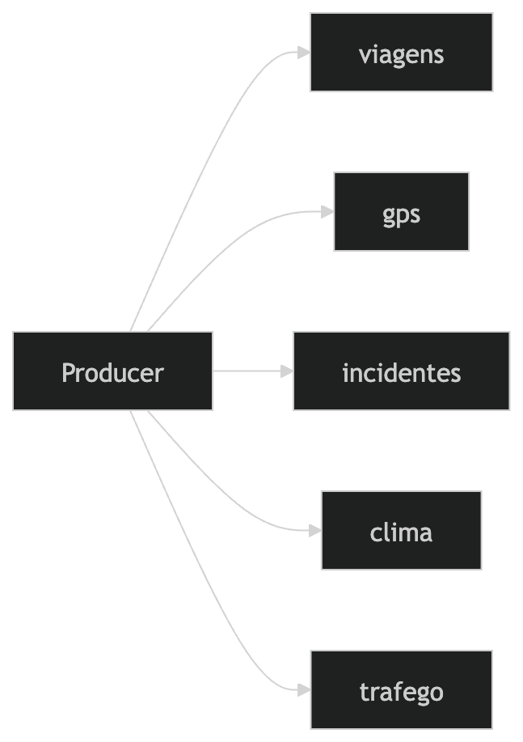

# UrbanFlow — Real-Time Urban Mobility Data Platform

Plataforma de Engenharia de Dados para mobilidade urbana em tempo real,
baseada em arquitetura Streaming + Lakehouse na AWS.

O projeto simula eventos urbanos (viagens, GPS, incidentes, clima e tráfego),
processa dados em streaming com Apache Kafka e Spark Structured Streaming,
armazena dados em um Data Lake no Amazon S3 e disponibiliza datasets analíticos
no Snowflake para consumo via dashboards no Amazon QuickSight.

Pipeline principal:

Producer → Kafka / MSK → Structured Streaming → Data Lake (S3) → Snowflake → dbt → Dashboards

---

# Arquitetura da Plataforma de Dados




## Fluxo do Pipeline

```text
Python Producer
↓
Apache Kafka (Amazon MSK)
↓
Spark Structured Streaming (PySpark)
↓
Amazon S3 Data Lake
Bronze → Silver → Gold
↓
Snowflake Data Warehouse
↓
dbt Transformations
↓
Amazon QuickSight
```
## Camadas do Data Lake

- **Bronze** → dados brutos vindos do streaming
- **Silver** → dados tratados e normalizados
- **Gold** → datasets agregados para analytics

## Stack Tecnológica

Linguagens
• Python
• SQL

Cloud
• AWS

Streaming
• Apache Kafka (Amazon MSK)

Processamento
• Apache Spark Structured Streaming

Data Lake
• Amazon S3

Data Warehouse
• Snowflake

Transformação Analítica
• dbt

Orquestração
• Apache Airflow

Business Intelligence
• Amazon QuickSight

Infraestrutura
• Terraform

## Estrutura do Projeto

```text
├── airflow
│   └── dags
│       └── urbanflow_silver_gold_dag.py
├── apps
│   └── producers
│       └── urbanflow_producer.py
├── architecture
│   ├── mermaid-diagram.png
│   ├── urbanflow-aws-architecture-diagram.png
│   ├── urbanflow-data-platform-architecture.md
│   └── urbanflow-kafka-producer-topics-diagram.png
├── config
│   ├── client_iam.properties
│   └── traffic_regions.json
├── data
│   └── simulator
├── dbt
│   ├── dbt_project.yml
│   └── models
│       ├── intermediate
│       ├── marts
│       └── staging
├── docs
│   ├── architecture
│   └── data_contracts
├── infra
│   └── terraform
├── jobs
│   ├── bronze
│   ├── silver
│   └── gold
├── kafka
│   ├── schemas
│   └── topics
├── scripts
└── snowflake
```

### Bloco 8 — execução

## Execução da Plataforma

1. Iniciar Python Producer
2. Publicar eventos no Kafka
3. Spark Structured Streaming grava dados na camada Bronze
4. Processos Silver tratam e padronizam os dados
5. Processos Gold geram datasets analíticos
6. Snowflake consome dados do Data Lake
7. dbt executa transformações analíticas no Data Warehouse
8. QuickSight gera dashboards

## Casos de Uso

- identificar regiões com maior congestionamento urbano
- analisar horários de pico
- medir impacto de clima no trânsito
- monitorar incidentes urbanos
- analisar tempo médio de viagens

