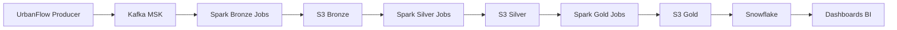

# UrbanFlow Data Platform

Plataforma de **Engenharia de Dados para mobilidade urbana em tempo real**, baseada em **Streaming Data Platform + Lakehouse Architecture**.

O projeto simula eventos urbanos (viagens, GPS, incidentes, clima e tráfego), processa dados em streaming e disponibiliza datasets analíticos para BI.

Pipeline principal:

Producer → Kafka / MSK → Spark Streaming → Data Lake (S3) → Snowflake → Dashboards

---

# Arquitetura da Plataforma


## Fluxo do Pipeline

```text
Python Producer
        ↓
Kafka / MSK
        ↓
Spark Structured Streaming (PySpark)
        ↓
S3 Data Lake
Bronze → Silver → Gold
        ↓
Snowflake
        ↓
dbt
        ↓
QuickSight
```
## Camadas do Data Lake

- **Bronze** → dados brutos vindos do streaming
- **Silver** → dados tratados e normalizados
- **Gold** → datasets agregados para analytics


## Stack Tecnológica

### Linguagem
- Python

### Cloud
- AWS

### Streaming
- Apache Kafka (Amazon MSK)

### Processamento de Dados
- Apache Spark Structured Streaming

### Data Lake
- Amazon S3

### Data Warehouse
- Snowflake

### Transformação Analítica
- dbt

### Orquestração
- Apache Airflow

### Infraestrutura
- Terraform

### Business Intelligence
- Amazon QuickSight

## Estrutura do Projeto

```text
├── airflow
│   └── dags
│       └── urbanflow_silver_gold_dag.py
├── apps
│   └── producers
│       └── urbanflow_producer.py
├── architecture
│   ├── mermaid-diagram.png
│   ├── urbanflow-aws-architecture-diagram.png
│   ├── urbanflow-data-platform-architecture.md
│   └── urbanflow-kafka-producer-topics-diagram.png
├── config
│   ├── client_iam.properties
│   └── traffic_regions.json
├── data
│   └── simulator
├── dbt
│   ├── dbt_project.yml
│   └── models
│       ├── intermediate
│       ├── marts
│       └── staging
├── docs
│   ├── architecture
│   └── data_contracts
├── infra
│   └── terraform
├── jobs
│   ├── bronze
│   ├── silver
│   └── gold
├── kafka
│   ├── schemas
│   └── topics
├── scripts
└── snowflake
```

### Bloco 8 — execução

## Execução da Plataforma

1. Iniciar Producer
2. Publicar eventos no Kafka
3. Spark Streaming grava dados na camada Bronze
4. Processos Silver tratam e padronizam os dados
5. Processos Gold geram datasets analíticos
6. Snowflake consome dados do Data Lake
7. QuickSight gera dashboards

## Casos de Uso

- identificar regiões com maior congestionamento
- analisar horários de pico
- medir impacto de clima no trânsito
- monitorar incidentes urbanos
- analisar tempo médio de viagens

