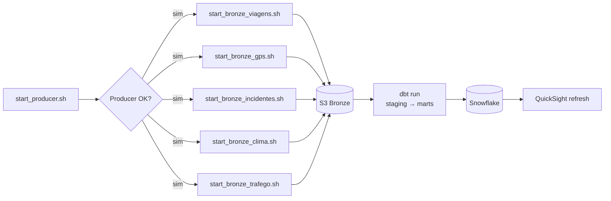

# UrbanFlow Data Platform

Plataforma de **Engenharia de Dados** para **análise de mobilidade urbana em tempo real**, baseada em arquitetura **Streaming + Lakehouse** com camadas **Bronze → Silver → Gold**, servindo dados para **Snowflake + QuickSight**.

O projeto simula e ingere eventos urbanos (viagens, GPS, incidentes, clima e tráfego), processa em streaming, organiza o Data Lake por camadas e publica **métricas e datasets analíticos**.

---

## Visão Geral (End-to-End)

```mermaid
flowchart LR
  subgraph S[Fontes]
    P[UrbanFlow Producer\n(simulador)]
    T[Traffic API\n(ex.: TomTom)]
    W[Weather API]
  end

  subgraph K[Streaming]
    MSK[(Kafka / MSK)]
    TOP[Topics\nviagens | gps | incidentes | clima | trafego]
  end

  subgraph PR[Processamento]
    SP[Spark Structured Streaming\njobs/bronze]
  end

  subgraph DL[Data Lake (S3)]
    BZ[(Bronze\nraw/append-only)]
    SV[(Silver\ncurated/conformed)]
    GD[(Gold\nanalytics/marts)]
  end

  subgraph TR[Transformações]
    DBT[dbt\nstaging → intermediate → marts]
  end

  subgraph WH[Warehouse / Serving]
    SF[(Snowflake)]
    QS[Amazon QuickSight\nDashboards]
  end

  P --> MSK
  T --> MSK
  W --> MSK

  MSK --> TOP --> SP --> BZ
  BZ --> DBT --> SV --> GD --> SF --> QS
```

---

## Arquitetura Robusta (Componentes + Governança + Observabilidade)

> Este diagrama detalha preocupações “de produção”: **catálogo/metadata**, **qualidade**, **monitoramento**, **CI/CD** e **segurança**.

```mermaid
flowchart TB
  %% ====================== SOURCES ======================
  subgraph SOURCES[Fontes de Dados]
    P[UrbanFlow Producer\napps/producers/urbanflow_producer.py]
    API1[Traffic API]
    API2[Weather API]
  end

  %% ====================== STREAMING ======================
  subgraph STREAM[Streaming Layer]
    MSK[(Kafka / MSK)]
    SR[Schema / Contracts\nkafka/schemas + docs/data_contracts]
    TP[Topics\nkafka/topics]
  end

  %% ====================== PROCESSING ======================
  subgraph PROC[Processing Layer]
    SP1[Spark Job: stream_viagens_to_s3_bronze.py]
    SP2[Spark Job: stream_gps_to_s3_bronze.py]
    SP3[Spark Job: stream_incidentes_to_s3_bronze.py]
    SP4[Spark Job: stream_clima_to_s3_bronze.py]
    SP5[Spark Job: stream_trafego_to_s3_bronze.py]
  end

  %% ====================== DATA LAKE ======================
  subgraph LAKE[Data Lake / Lakehouse]
    S3[(Amazon S3)]
    BZ[(Bronze)]
    SV[(Silver)]
    GD[(Gold)]
    CAT[Catálogo / Metadados\n(ex.: Glue Catalog)]
  end

  %% ====================== TRANSFORM ======================
  subgraph TRANS[Transformações / Modelagem]
    DBT[dbt models\nstaging → intermediate → marts]
    TESTS[Data Quality\n(dbts tests / constraints)]
  end

  %% ====================== WAREHOUSE & BI ======================
  subgraph SERVE[Serving]
    SF[(Snowflake)]
    QS[QuickSight]
  end

  %% ====================== ORCHESTRATION ======================
  subgraph ORCH[Orquestração]
    AF[Airflow / MWAA\n(airflow/dags)]
    SCRIPTS[scripts/\nstart_* + health checks]
  end

  %% ====================== OBSERVABILITY ======================
  subgraph OBS[Observabilidade]
    LOGS[Logs/Tracing\n(Spark/Driver/Executors)]
    METRICS[Métricas\nlag, throughput, erros, latência]
    ALERTS[Alertas\n(SLA, falhas, anomalias)]
  end

  %% ====================== SECURITY ======================
  subgraph SEC[Segurança]
    IAM[IAM / Policies]
    SECRETS[Secrets\n(API keys, creds)]
  end

  %% ====================== CI/CD ======================
  subgraph CICD[CI/CD]
    GIT[GitHub]
    PIPE[Pipeline CI\nlint/tests/build]
    TF[Terraform\ninfra/terraform]
  end

  %% ---------- Flows ----------
  P --> MSK
  API1 --> MSK
  API2 --> MSK

  SR --> MSK
  MSK --> TP

  TP --> SP1 --> S3
  TP --> SP2 --> S3
  TP --> SP3 --> S3
  TP --> SP4 --> S3
  TP --> SP5 --> S3

  S3 --> BZ --> DBT --> SV --> GD --> SF --> QS
  CAT --- BZ
  CAT --- SV
  CAT --- GD

  AF --> SCRIPTS
  AF --> SP1
  AF --> SP2
  AF --> SP3
  AF --> SP4
  AF --> SP5
  AF --> DBT

  SP1 --> LOGS
  SP2 --> LOGS
  SP3 --> LOGS
  SP4 --> LOGS
  SP5 --> LOGS

  LOGS --> METRICS --> ALERTS

  TF --> IAM
  TF --> MSK
  TF --> S3
  TF --> SECRETS

  GIT --> PIPE --> TF
  GIT --> PIPE --> DBT
```

---

## Streaming (Kafka) — Topics, Producers e Consumers

> Útil para deixar claro o design de streaming: **topic por domínio**, consumidores independentes e gravação em Bronze.

```mermaid
flowchart LR
  subgraph PROD[Producer]
    UP[UrbanFlow Producer]
  end

  subgraph KAFKA[Kafka / MSK]
    V[(topic: urbanflow_viagens)]
    G[(topic: urbanflow_gps)]
    I[(topic: urbanflow_incidentes)]
    C[(topic: urbanflow_clima)]
    T[(topic: urbanflow_trafego)]
  end

  subgraph CONS[Consumers (Spark)]
    SVJ[Spark consumer\nviagens → S3/bronze/viagens]
    SGPS[Spark consumer\ngps → S3/bronze/gps]
    SINC[Spark consumer\nincidentes → S3/bronze/incidentes]
    SCLI[Spark consumer\nclima → S3/bronze/clima]
    STRA[Spark consumer\ntrafego → S3/bronze/trafego]
  end

  UP --> V
  UP --> G
  UP --> I
  UP --> C
  UP --> T

  V --> SVJ
  G --> SGPS
  I --> SINC
  C --> SCLI
  T --> STRA
```

---

## Lakehouse — Bronze → Silver → Gold (Lineage / Data Lineage)

> Diagrama de lineage deixa bem “profissional” no GitHub.

```mermaid
flowchart TB
  subgraph BR[Bronze (raw)]
    B1[bronze_viagens]
    B2[bronze_gps]
    B3[bronze_incidentes]
    B4[bronze_clima]
    B5[bronze_trafego]
  end

  subgraph STG[Staging (dbt)]
    S1[stg_viagens]
    S2[stg_gps]
    S3[stg_incidentes]
    S4[stg_clima]
    S5[stg_trafego]
  end

  subgraph INT[Intermediate (dbt)]
    I1[int_eventos_consolidados]
    I2[int_enriquecimento_trafego]
  end

  subgraph MARTS[Gold / Marts (dbt)]
    M1[mart_mobilidade_diaria]
    M2[mart_congestionamento_horario]
    M3[mart_incidentes_por_regiao]
    M4[mart_tempo_medio_viagem]
  end

  B1 --> S1
  B2 --> S2
  B3 --> S3
  B4 --> S4
  B5 --> S5

  S1 --> I1
  S2 --> I1
  S3 --> I1
  S4 --> I1
  S5 --> I2
  I1 --> I2

  I2 --> M1
  I2 --> M2
  I2 --> M3
  I2 --> M4
```

---

## Orquestração (Airflow) — DAG de ponta a ponta

> Mostra como a plataforma roda “de verdade” (start/healthcheck, jobs Bronze e transformação).



---

# Camadas do Data Lake

## Bronze

Dados ingeridos em estado bruto (**append-only**), com partições por data (quando aplicável).

- eventos de **viagens**
- eventos de **gps**
- eventos de **incidentes**
- eventos de **clima**
- eventos de **tráfego**

Estrutura exemplo:

```
s3://<bucket>/urbanflow/bronze/
  ├── viagens/
  ├── gps/
  ├── incidentes/
  ├── clima/
  └── trafego/
```

## Silver

Dados tratados e normalizados (curated). Transformações típicas:

- limpeza/padronização de campos
- enriquecimento (ex.: tráfego + viagens)
- deduplicação
- conformidade com contratos

## Gold

Camada analítica (marts) para BI/consumo:

- congestionamento por região/hora
- tempo médio de viagem
- incidentes por região/hora
- mobilidade por cidade

---

# Stack Tecnológica

- **Cloud:** AWS
- **Streaming:** Kafka / MSK
- **Processing:** Spark Structured Streaming
- **Data Lake:** S3 + Parquet
- **Transformação:** dbt
- **Warehouse:** Snowflake
- **Orquestração:** Airflow (MWAA) + scripts auxiliares
- **Infra:** Terraform
- **BI:** QuickSight

---

# Estrutura do Projeto (atual)

```text
urbanflow-data-platform
├── airflow
│   ├── dags
│   └── plugins
├── apps
│   └── producers
├── data
│   └── simulator
├── dbt
│   └── models
│       ├── intermediate
│       ├── marts
│       └── staging
├── docs
│   ├── architecture
│   └── data_contracts
├── infra
│   └── terraform
│       ├── envs
│       │   ├── dev
│       │   ├── hml
│       │   └── prod
│       └── modules
├── jobs
│   └── bronze
├── kafka
│   ├── schemas
│   └── topics
├── scripts
└── README.md
```

---

# Como Executar (alto nível)

1. Subir/validar Producer
2. Garantir MSK/Kafka e tópicos existentes
3. Subir jobs Bronze (Spark Streaming) para gravar no S3
4. Rodar dbt (Silver/Gold) e publicar no Snowflake
5. Construir/atualizar dashboards no QuickSight

---

# Casos de Uso

- identificar regiões com maior congestionamento
- analisar horários de pico
- medir impacto de incidentes e clima no trânsito
- acompanhar volume e tempo de viagens por cidade/região

---

# Roadmap

- Implementar camada **Silver** e **Gold** (dbt completo)
- Data Quality (tests/constraints + checagens de schema)
- Observabilidade (dashboards de pipeline + alertas)
- CI/CD (lint/test/build + validação dbt + terraform plan)
- Documentar contratos (docs/data_contracts) e exemplos (docs/architecture)

---

# Autor

Leandro Santos  
GitHub: https://github.com/leandroslax
