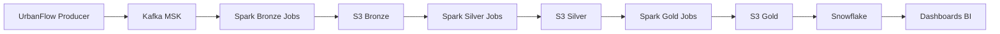

# UrbanFlow Data Platform

Plataforma de **Engenharia de Dados para mobilidade urbana em tempo real**, baseada em **Streaming Data Platform + Lakehouse Architecture**.

O projeto simula eventos urbanos (viagens, GPS, incidentes, clima e tráfego), processa dados em streaming e disponibiliza datasets analíticos para BI.

Pipeline principal:

Producer → Kafka / MSK → Spark Streaming → Data Lake (S3) → Snowflake → Dashboards

---

# Arquitetura da Plataforma

Stack Tecnológica

AWS

Kafka / MSK

Spark Structured Streaming

Amazon S3

Snowflake

dbt

Apache Airflow

Terraform

Amazon QuickSight

Estrutura do Projeto
.
├── airflow
│   └── dags
│       └── urbanflow_silver_gold_dag.py
├── apps
│   └── producers
│       └── urbanflow_producer.py
├── architecture
│   ├── mermaid-diagram.png
│   ├── urbanflow-aws-architecture-diagram.png
│   ├── urbanflow-data-platform-architecture.md
│   └── urbanflow-kafka-producer-topics-diagram.png
├── config
│   ├── client_iam.properties
│   └── traffic_regions.json
├── data
│   └── simulator
├── dbt
│   ├── dbt_project.yml
│   └── models
│       ├── intermediate
│       ├── marts
│       └── staging
├── docs
│   ├── architecture
│   └── data_contracts
├── infra
│   └── terraform
├── jobs
│   ├── bronze
│   ├── silver
│   └── gold
├── kafka
│   ├── schemas
│   └── topics
├── scripts
└── snowflake
Execução da Plataforma

Iniciar Producer

Publicar eventos no Kafka

Spark Streaming grava dados na camada Bronze

Processos Silver tratam e padronizam os dados

Processos Gold geram datasets analíticos

Snowflake consome dados do Data Lake

QuickSight gera dashboards

Casos de Uso

identificar regiões com maior congestionamento

analisar horários de pico

medir impacto de clima no trânsito

monitorar incidentes urbanos

analisar tempo médio de viagens