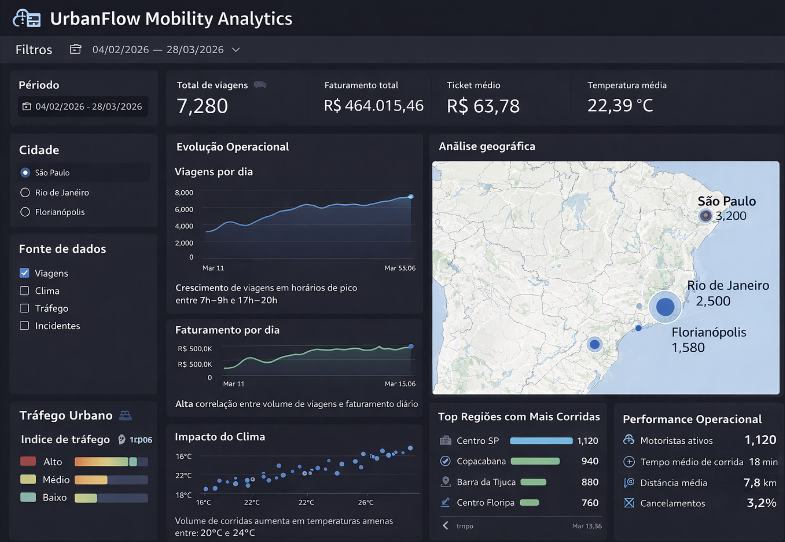
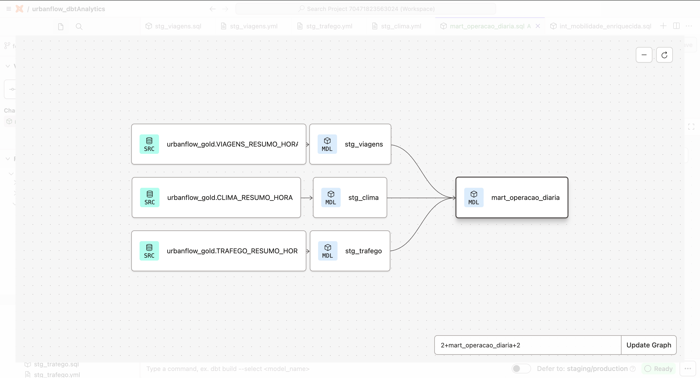

# UrbanFlow — Real-Time Urban Mobility Data Platform

Plataforma de Engenharia de Dados para mobilidade urbana em tempo real,
baseada em arquitetura Streaming + Lakehouse na AWS.

O projeto simula eventos urbanos (viagens, GPS, incidentes, clima e tráfego),
processa dados em streaming com Apache Kafka e Spark Structured Streaming,
armazena dados em um Data Lake no Amazon S3 e disponibiliza datasets analíticos
no Snowflake para consumo via dashboards no Amazon QuickSight.

Pipeline principal:

Producer → Kafka / MSK → Spark Structured Streaming → Data Lake (S3) → Snowflake → dbt → Dashboards

---

# Arquitetura da Plataforma de Dados


---

# UrbanFlow Mobility Analytics Dashboard



O projeto simula eventos urbanos (viagens, GPS, incidentes, clima e tráfego),
processa dados em streaming com Apache Kafka e Spark Structured Streaming,
armazena dados em um Data Lake no Amazon S3 e disponibiliza datasets analíticos
no Snowflake para consumo via dashboards no Amazon QuickSight.

Os componentes da plataforma são executados como services no host,
garantindo processamento contínuo, reinício automático em caso de falha
e operação em tempo real do pipeline de dados.

Principais métricas exibidas:

• Total de viagens  
• Faturamento total  
• Ticket médio por corrida  
• Temperatura média  
• Evolução diária de viagens  
• Evolução diária de faturamento  
• Impacto das condições climáticas  
• Índice de tráfego urbano  
• Distribuição geográfica das corridas  
• Top regiões com maior volume de viagens  

Os dados são gerados pelo pipeline de streaming e processados pelas camadas
Bronze, Silver e Gold antes de serem disponibilizados no Snowflake e consumidos
pelo Amazon QuickSight.


## Fluxo do Pipeline

```text
Python Producer
↓
Apache Kafka (Amazon MSK)
↓
Spark Structured Streaming (PySpark)
↓
Amazon S3 Data Lake
Bronze → Silver → Gold
↓
Snowflake Data Warehouse
↓
dbt Transformations
↓
Amazon QuickSight
```
## Camadas do Data Lake

- **Bronze** → dados brutos vindos do streaming
- **Silver** → dados tratados e normalizados
- **Gold** → datasets agregados para analytics

---

# Modelagem Analítica com dbt

As transformações analíticas são realizadas utilizando **dbt (Data Build Tool)** no Snowflake.

Os dados agregados da camada **Gold** são utilizados como fontes para os modelos dbt,
onde são organizados em camadas de **staging**, **intermediate** e **marts analíticos**.

O diagrama abaixo representa a linhagem dos modelos dbt utilizados na plataforma.



### Estrutura de Modelos

**Sources**

Datasets agregados provenientes da camada Gold do Data Lake:

- `VIAGENS_RESUMO_HORA`
- `CLIMA_RESUMO_HORA`
- `TRAFEGO_RESUMO_HORA`

**Staging**

Padronização e limpeza dos dados:

- `stg_viagens`
- `stg_clima`
- `stg_trafego`

**Intermediate**

Enriquecimento de dados e integrações entre datasets:

- `int_mobilidade_enriquecida`

**Marts Analíticos**

Datasets finais utilizados para análise e dashboards:

- `mart_mobilidade_diaria`
- `mart_congestionamento_por_hora`
- `mart_tempo_medio_viagem`

## Stack Tecnológica

Linguagens
• Python
• SQL

Cloud
• AWS

Streaming
• Apache Kafka (Amazon MSK)

Processamento
• Apache Spark Structured Streaming

Data Lake
• Amazon S3

Data Warehouse
• Snowflake

Transformação Analítica
• dbt

Execução e Automação
• systemd services
• Shell scripts

Business Intelligence
• Amazon QuickSight

Infraestrutura
• Terraform

## Estrutura do Projeto

```text

├── apps
│   └── producers
│       └── urbanflow_producer.py
├── architecture
│   ├── mermaid-diagram.png
│   ├── urbanflow-aws-architecture-diagram.png
│   ├── urbanflow-data-platform-architecture.md
│   └── urbanflow-kafka-producer-topics-diagram.png
├── config
│   ├── client_iam.properties
│   └── traffic_regions.json
├── dashboard
│   ├── app.py
│   └── docs
│       └── images
│           └── urbanflow_dashboard.jpg
├── data
│   └── simulator
├── dbt
│   ├── dbt_project.yml
│   ├── docs
│   │   └── diagrama_dbt_urbanflow.png
│   ├── models
│   │   ├── intermediate
│   │   │   └── int_mobilidade_enriquecida.sql
│   │   ├── marts
│   │   │   ├── mart_congestionamento_por_hora.sql
│   │   │   ├── mart_mobilidade_diaria.sql
│   │   │   └── mart_tempo_medio_viagem.sql
│   │   └── staging
│   │       ├── sources.yml
│   │       ├── stg_clima.sql
│   │       ├── stg_clima.yml
│   │       ├── stg_trafego.sql
│   │       ├── stg_trafego.yml
│   │       ├── stg_viagens.sql
│   │       └── stg_viagens.yml
│   └── profiles.yml
├── docs
│   ├── architecture
│   └── data_contracts
├── infra
│   └── terraform
│       ├── envs
│       │   ├── dev
│       │   │   ├── main.tf
│       │   │   ├── msk.tf
│       │   │   ├── outputs.tf
│       │   │   ├── provider.tf
│       │   │   ├── terraform.tfvars
│       │   │   ├── terraform.tfvars.example
│       │   │   ├── urbanflow-s3-access.json
│       │   │   ├── variables.tf
│       │   │   └── versions.tf
│       │   ├── hml
│       │   └── prod
│       └── modules
├── jobs
│   ├── bronze
│   │   ├── stream_clima_to_s3_bronze.py
│   │   ├── stream_gps_to_s3_bronze.py
│   │   ├── stream_incidentes_to_s3_bronze.py
│   │   ├── stream_trafego_to_s3_bronze.py
│   │   └── stream_viagens_to_s3_bronze.py
│   ├── gold
│   │   ├── build_clima_gold_resumo_hora.py
│   │   ├── build_gps_gold_resumo_hora.py
│   │   ├── build_incidentes_gold_resumo_hora.py
│   │   ├── build_trafego_gold_resumo_hora.py
│   │   ├── build_viagens_gold_resumo_hora.py
│   │   ├── stream_clima_silver_to_gold.py
│   │   ├── stream_gps_silver_to_gold.py
│   │   ├── stream_incidentes_silver_to_gold.py
│   │   ├── stream_trafego_silver_to_gold.py
│   │   └── stream_viagens_silver_to_gold.py
│   └── silver
│       ├── build_gps_bronze_to_silver.py
│       ├── stream_clima_bronze_to_silver.py
│       ├── stream_gps_bronze_to_silver.py
│       ├── stream_incidentes_bronze_to_silver.py
│       ├── stream_trafego_bronze_to_silver.py
│       └── stream_viagens_bronze_to_silver.py
├── kafka
│   ├── schemas
│   └── topics
├── README.md
├── scripts
│   ├── check_urbanflow.sh
│   ├── start_bronze_clima.sh
│   ├── start_bronze_gps.sh
│   ├── start_bronze_incidentes.sh
│   ├── start_bronze_trafego.sh
│   ├── start_bronze_viagens.sh
│   ├── start_clima_silver.sh
│   ├── start_gold_clima_batch.sh
│   ├── start_gold_clima.sh
│   ├── start_gold_gps_batch.sh
│   ├── start_gold_gps.sh
│   ├── start_gold_incidentes_batch.sh
│   ├── start_gold_incidentes.sh
│   ├── start_gold_trafego_batch.sh
│   ├── start_gold_trafego.sh
│   ├── start_gold_viagens_batch.sh
│   ├── start_gold_viagens.sh
│   ├── start_gps_silver.sh
│   ├── start_producer.sh
│   ├── start_silver_clima.sh
│   ├── start_silver_gps_batch.sh
│   ├── start_silver_gps.sh
│   ├── start_silver_incidentes.sh
│   ├── start_silver_trafego.sh
│   ├── start_silver_viagens.sh
│   └── start_trafego_silver.sh
└── snowflake
    ├── 00_bootstrap
    │   ├── 001_create_warehouse.sql
    │   ├── 002_create_database.sql
    │   └── 003_create_schemas.sql
    ├── 20_integrations
    │   ├── 001_storage_integration.sql
    │   └── 002_external_stage.sql
    ├── 30_landing_raw
    │   ├── 001_create_viagens_resumo_hora.sql
    │   ├── 002_create_clima_resumo_hora.sql
    │   ├── 003_create_gps_mobilidade_hora.sql
    │   ├── 004_create_incidentes_resumo_hora.sql
    │   └── 005_create_trafego_resumo_hora.sql
    ├── 40_loading
    │   └── 001_copy_viagens_resumo_hora.sql
    └── 50_marts
        ├── 001_create_mart_viagens_diarias.sql
        └── 002_validation_queries.sql
```

### Bloco 8 — execução

## Execução da Plataforma

A plataforma opera continuamente por meio de services configurados no host.

1. O Producer publica eventos no Kafka (Amazon MSK)
2. Jobs de ingestão Spark consomem eventos em streaming
3. Dados são gravados no Amazon S3 na camada Bronze
4. Processos Silver tratam e normalizam os dados
5. Processos Gold geram datasets analíticos
6. Snowflake consome datasets analíticos do Data Lake
7. dbt executa transformações analíticas no Data Warehouse
8. Amazon QuickSight consome os datasets para dashboards

## Casos de Uso

- identificar regiões com maior congestionamento urbano
- analisar horários de pico
- medir impacto de clima no trânsito
- monitorar incidentes urbanos
- analisar tempo médio de viagens

