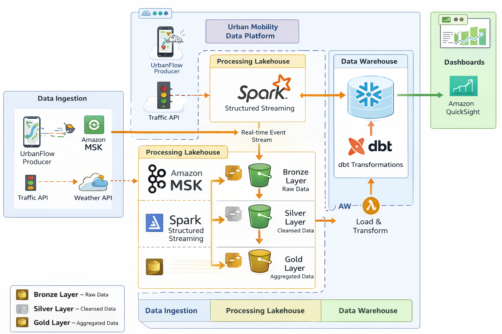

# UrbanFlow Data Platform

Plataforma de **Engenharia de Dados para mobilidade urbana em tempo real**, baseada em **Streaming Data Platform + Lakehouse Architecture**.

O projeto simula eventos urbanos (viagens, GPS, incidentes, clima e tráfego), processa dados em streaming e disponibiliza datasets analíticos para BI.

Pipeline principal:

Producer → Kafka / MSK → Spark Streaming → Data Lake (S3) → Snowflake → Dashboards

## Arquitetura da Plataforma



```mermaid
flowchart LR
    P[UrbanFlow Producer] --> K[Kafka MSK]

    K --> B[Spark Bronze Jobs]
    B --> S3B[S3 Bronze]

    S3B --> S[Spark Silver Jobs]
    S --> S3S[S3 Silver]

    S3S --> G[Spark Gold Jobs]
    G --> S3G[S3 Gold]

    S3G --> SN[Snowflake]
    SN --> BI[Dashboards BI]

---

# 3️⃣ Streaming Topics

```markdown
## Streaming Topics

```mermaid
flowchart LR
    P[Producer]

    P --> V[topic urbanflow_viagens]
    P --> G[topic urbanflow_gps]
    P --> I[topic urbanflow_incidentes]
    P --> C[topic urbanflow_clima]
    P --> T[topic urbanflow_trafego]

---

# 4️⃣ Pipeline Bronze → Silver → Gold

```markdown
## Pipeline Lakehouse

```mermaid
flowchart LR

    B1[Bronze Viagens]
    B2[Bronze GPS]
    B3[Bronze Incidentes]
    B4[Bronze Clima]
    B5[Bronze Trafego]

    B1 --> S1[Silver Viagens]
    B2 --> S2[Silver GPS]
    B3 --> S3[Silver Incidentes]
    B4 --> S4[Silver Clima]
    B5 --> S5[Silver Trafego]

    S1 --> G1[Gold Mobilidade]
    S2 --> G1
    S3 --> G2[Gold Incidentes]
    S4 --> G1
    S5 --> G1

---

# 5️⃣ Stack Tecnológica

```markdown
## Stack Tecnológica

- AWS
- Kafka / MSK
- Spark Structured Streaming
- Amazon S3
- Snowflake
- dbt
- Apache Airflow
- Terraform
- Amazon QuickSight

## Estrutura do Projeto
.
├── ~$README.md
├── airflow
│   └── dags
│       └── urbanflow_silver_gold_dag.py
├── apps
│   └── producers
│       ├── __pycache__
│       │   └── urbanflow_producer.cpython-311.pyc
│       ├── urbanflow_producer.bkp
│       └── urbanflow_producer.py
├── architecture
│   ├── urbanflow-aws-architecture-diagram.png
│   ├── urbanflow-data-platform-architecture.md
│   └── urbanflow-kafka-producer-topics-diagram.png
├── config
│   ├── client_iam.properties
│   └── traffic_regions.json
├── data
│   └── simulator
├── dbt
│   ├── dbt_project.yml
│   └── models
│       ├── intermediate
│       │   └── int_mobilidade_enriquecida.sql
│       ├── marts
│       │   ├── mart_congestionamento_por_hora.sql
│       │   ├── mart_incidentes_por_regiao.sql
│       │   ├── mart_mobilidade_diaria.sql
│       │   └── mart_tempo_medio_viagem.sql
│       └── staging
│           ├── sources.yml
│           ├── stg_clima.sql
│           ├── stg_gps.sql
│           ├── stg_incidentes.sql
│           ├── stg_trafego.sql
│           └── stg_viagens.sql
├── docs
│   ├── architecture
│   └── data_contracts
├── infra
│   └── terraform
│       ├── envs
│       │   ├── dev
│       │   │   ├── main.tf
│       │   │   ├── msk.tf
│       │   │   ├── outputs.tf
│       │   │   ├── provider.tf
│       │   │   ├── terraform.tfstate.backup
│       │   │   ├── terraform.tfvars
│       │   │   ├── terraform.tfvars.example
│       │   │   ├── urbanflow-s3-access.json
│       │   │   ├── variables.tf
│       │   │   └── versions.tf
│       │   ├── hml
│       │   └── prod
│       └── modules
├── jobs
│   ├── bronze
│   │   ├── __pycache__
│   │   │   └── stream_viagens_to_s3_bronze.cpython-39.pyc
│   │   ├── stream_clima_to_s3_bronze.py
│   │   ├── stream_clima_to_s3_bronze.py.bak.2026-03-04-212320
│   │   ├── stream_clima_to_s3_bronze.py.bak.2026-03-04-213450
│   │   ├── stream_gps_to_s3_bronze.py
│   │   ├── stream_incidentes_to_s3_bronze.py
│   │   ├── stream_incidentes_to_s3_bronze.py.bak.2026-03-04-212312
│   │   ├── stream_trafego_to_s3_bronze.py
│   │   └── stream_viagens_to_s3_bronze.py
│   ├── gold
│   │   ├── build_clima_gold_resumo_hora_v2.py
│   │   ├── build_clima_gold_resumo_hora_v3.py
│   │   ├── build_clima_gold_resumo_hora_v4.py
│   │   ├── build_clima_gold_resumo_hora_v5.py
│   │   ├── build_clima_gold_resumo_hora_v6.py
│   │   ├── build_clima_gold_resumo_hora_v7.py
│   │   ├── build_clima_gold_resumo_hora.py
│   │   ├── build_gps_gold_resumo_hora.py
│   │   ├── build_incidentes_gold_resumo_hora_v2.py
│   │   ├── build_incidentes_gold_resumo_hora_v3.py
│   │   ├── build_incidentes_gold_resumo_hora_v4.py
│   │   ├── build_incidentes_gold_resumo_hora.py
│   │   ├── build_trafego_gold_resumo_hora.py
│   │   ├── build_viagens_gold_resumo_hora.py
│   │   ├── rebuild_viagens_gold_v2.py
│   │   ├── stream_clima_silver_to_gold_v1.py
│   │   ├── stream_gps_silver_to_gold_v3.py
│   │   ├── stream_gps_silver_to_gold.py
│   │   ├── stream_incidentes_silver_to_gold_v1.py
│   │   ├── stream_trafego_silver_to_gold_v1.py
│   │   ├── stream_viagens_silver_to_gold_v1.py
│   │   └── stream_viagens_silver_v2_to_gold_v3.py
│   └── silver
│       ├── build_gps_bronze_to_silver_v4.py
│       ├── stream_clima_bronze_to_silver.py
│       ├── stream_gps_bronze_to_silver.py
│       ├── stream_incidentes_bronze_to_silver.py
│       ├── stream_trafego_bronze_to_silver.py
│       ├── stream_viagens_bronze_to_silver_v2.py
│       └── stream_viagens_bronze_to_silver.py
├── kafka
│   ├── schemas
│   └── topics
├── README.md
├── scripts
│   ├── check_urbanflow.sh
│   ├── start_bronze_clima.sh
│   ├── start_bronze_gps.sh
│   ├── start_bronze_incidentes.sh
│   ├── start_bronze_trafego.sh
│   ├── start_bronze_viagens.sh
│   ├── start_clima_silver.sh
│   ├── start_gold_clima_batch.sh
│   ├── start_gold_clima.sh
│   ├── start_gold_gps_batch.sh
│   ├── start_gold_gps.sh
│   ├── start_gold_incidentes_batch.sh
│   ├── start_gold_incidentes.sh
│   ├── start_gold_trafego_batch.sh
│   ├── start_gold_trafego.sh
│   ├── start_gold_viagens_batch.sh
│   ├── start_gold_viagens_v3.sh
│   ├── start_gold_viagens.sh
│   ├── start_gps_silver.sh
│   ├── start_producer.bkp
│   ├── start_producer.sh
│   ├── start_silver_clima.sh
│   ├── start_silver_gps_batch.sh
│   ├── start_silver_gps.sh
│   ├── start_silver_incidentes.sh
│   ├── start_silver_trafego.sh
│   ├── start_silver_viagens_v2.sh
│   ├── start_silver_viagens.sh
│   └── start_trafego_silver.sh
└── snowflake
    ├── 00_bootstrap
    │   └── 00_databases_schemas.sql
    ├── 20_integrations
    │   ├── 10_file_formats.sql
    │   └── 20_stages.sql
    ├── 30_landing_raw
    │   └── 10_tables_silver.sql
    └── 40_loading
        └── 10_copy_into_silver.sql

39 directories, 105 files

## Execução da Plataforma

1. Iniciar Producer
2. Publicar eventos no Kafka
3. Spark Streaming grava dados na camada Bronze
4. Processos Silver tratam e padronizam os dados
5. Processos Gold geram datasets analíticos
6. Snowflake consome dados do Data Lake
7. QuickSight gera dashboards

## Casos de Uso

- identificar regiões com maior congestionamento
- analisar horários de pico
- medir impacto de clima no trânsito
- monitorar incidentes urbanos
- analisar tempo médio de viagens

